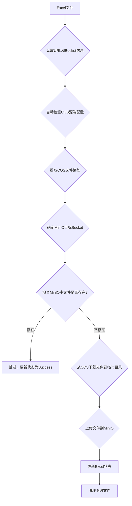

# COS2MinIO - 腾讯云COS到MinIO迁移工具

这是一个用于将文件从腾讯云COS迁移到本地MinIO服务器的工具。工具通过读取Excel文件中的URL链接，批量下载文件并上传到MinIO，保持原始的文件路径结构。

## 核心功能

- ✅ **Excel URL管理**: 通过Excel文件管理要迁移的COS文件URL列表
- ✅ **批量下载**: 从腾讯云COS批量下载文件
- ✅ **批量上传**: 批量上传到MinIO服务器
- ✅ **路径保持**: 保持原始COS文件路径结构
- ✅ **目标bucket指定**: 支持在Excel中指定每个文件的目标MinIO bucket
- ✅ **COS源自动检测**: 自动检测COS源端的配置（基于URL域名）
- ✅ **并发处理**: 支持多线程并发，提高迁移效率
- ✅ **断点续传**: 支持恢复失败的迁移任务
- ✅ **状态管理**: 实时更新Excel中的迁移状态
- ✅ **去重处理**: 自动跳过已存在的文件

## 安装

### 1. 克隆项目
```bash
git clone <repository-url>
cd cos2minio
```

### 2. 创建虚拟环境（推荐）
```bash
python -m venv .venv
source .venv/bin/activate  # Linux/Mac
# 或
.venv\Scripts\activate     # Windows
```

### 3. 安装依赖
```bash
pip install -r requirements.txt
```

## 配置

### 1. 配置环境变量

为了安全地管理敏感信息，本项目使用环境变量来配置MinIO和COS的凭证。

首先，复制 `example.env` 文件并重命名为 `.env`：

```bash
cp example.env .env
```

然后，编辑 `.env` 文件，将占位符替换为您的实际凭证信息：

```ini
# MinIO Configuration
MINIO_ENDPOINT=your_minio_endpoint:port
MINIO_ACCESS_KEY=your_minio_access_key
MINIO_SECRET_KEY=your_minio_secret_key
MINIO_SECURE=False # Set to True if using HTTPS
MINIO_BUCKET_NAME=your_minio_bucket_name

# COS Configuration - Example
COS_YOUR_COS_NAME_SECRET_ID=your_cos_secret_id
COS_YOUR_COS_NAME_SECRET_KEY=your_cos_secret_key
COS_YOUR_COS_NAME_REGION=your_cos_region
COS_YOUR_COS_NAME_BUCKET=your_cos_bucket
# ... 添加更多COS配置，格式为 COS_YOUR_COS_NAME_SECRET_ID 等
```

**注意：**
- `MINIO_SECURE` 环境变量的值应为 `True` 或 `False` 字符串。
- 对于COS配置，请根据 `config.py` 中 `COS_CONFIGS` 的键名（例如 `frcdap-dev`, `video`）来命名环境变量，格式为 `COS_KEYNAME_SECRET_ID`、`COS_KEYNAME_SECRET_KEY` 等。

### 2. 修改 `config.py` （可选）

通常情况下，您不需要修改 `config.py` 文件，因为它会自动从环境变量中加载配置。

如果您需要调整默认的COS配置名称或日志级别等非敏感配置，可以编辑 `config.py`：

```python
# 默认使用的COS配置
DEFAULT_COS_CONFIG = 'video' # 修改为您在.env中配置的COS名称

# 日志配置
LOG_CONFIG = {
    'level': 'INFO', # 可选 'DEBUG', 'INFO', 'WARNING', 'ERROR', 'CRITICAL'
    'format': '%(asctime)s [%(levelname)s] %(message)s',
    'file': 'cos2minio.log'
}
```

### 2. 准备Excel文件

Excel文件应包含以下列：
- `url`: COS文件的完整URL（必需）
- `buckets`: 目标MinIO bucket名称（可选，为空时使用默认bucket）
- `status`: 迁移状态（自动管理，可为空）

示例Excel格式：
| id | name | url | type | buckets | status |
|----|------|-----|------|---------|--------|
| 1 | 视频1 | https://bucket.cos.region.myqcloud.com/path/to/file.mp4 | video | video-storage | pending |
| 2 | 图片1 | https://bucket.cos.region.myqcloud.com/images/pic.jpg | image | image-files | pending |
| 3 | 文档1 | https://bucket.cos.region.myqcloud.com/docs/doc.pdf | document | | pending |

**注意：**
- `buckets`列用于指定文件上传到MinIO的目标bucket。
- 如果`buckets`列为空，将使用配置文件中的默认MinIO bucket。
- URL域名后的路径将完整保留为MinIO中的对象路径。

可以使用以下命令创建示例文件：
```bash
# 创建基础示例文件
python create_sample_excel.py

# 创建包含buckets字段的示例文件
python create_sample_excel_with_buckets.py
```

## 使用方法

### 基本用法
```bash
python cos2minio.py your_excel_file.xlsx
```

### 高级选项
```bash
python cos2minio.py your_excel_file.xlsx \
    --cos-config video \
    --max-workers 10 \
    --temp-dir ./temp \
    --resume
```

### 参数说明
- `excel_path`: Excel文件路径（必需）
- `--cos-config`: COS配置名称（可选，默认使用config.py中的DEFAULT_COS_CONFIG）
- `--max-workers`: 最大并发数（可选，默认5）
- `--temp-dir`: 临时目录路径（可选，默认`./temp_downloads`）
- `--resume`: 恢复之前的迁移，只处理失败和待处理的文件
- `--status-filter`: 状态过滤器，指定要处理的文件状态 (例如: `pending`, `failed`, `success`)

## 工作流程



### 详细步骤

1.  **读取Excel**: 从Excel文件中提取URL和目标bucket信息。
2.  **COS源检测**: 根据URL域名自动检测并切换到对应的COS源配置。
3.  **路径提取**: 从URL中提取文件路径。
4.  **目标bucket确定**: 使用Excel中的`buckets`字段或配置文件中的默认MinIO bucket。
5.  **存在性检查**: 检查COS源文件和MinIO目标文件的存在性。如果MinIO中已存在，则跳过并标记为成功。
6.  **文件下载**: 从对应的COS源下载文件到临时目录。
7.  **文件上传**: 将文件上传到指定的MinIO bucket，保持原始路径结构。
8.  **状态更新**: 更新Excel中的迁移状态（`pending`, `processing`, `success`, `failed`）。
9.  **清理临时文件**: 删除临时下载的文件。

## 文件结构

```
cos2minio/
├── cos2minio.py           # 主程序
├── config.py              # 配置文件
├── excel_processor.py     # Excel处理模块
├── cos_downloader.py      # COS下载模块
├── minio_uploader.py      # MinIO上传模块
├── create_sample_excel.py # 示例Excel创建工具
├── create_sample_excel_with_buckets.py # 包含bucket字段的示例Excel创建工具
├── requirements.txt       # 依赖包列表
├── README.md              # 说明文档
├── docker-compose.yml     # Docker Compose配置
├── Dockerfile             # Dockerfile
└── setup.sh               # 环境设置脚本
```

## 日志和状态管理

### 日志文件
- **控制台输出**: 实时显示处理进度。
- **日志文件**: `cos2minio.log`，记录详细的操作日志。

### Excel状态字段
Excel文件中的`status`列会自动更新：
- `pending`: 待处理
- `processing`: 处理中
- `success`: 成功
- `failed`: 失败

### 实时统计
程序会在控制台输出实时进度和最终统计信息：
```
[INFO] 开始迁移，共100个文件，最大并发数: 5
[INFO] ✓ 完成 (45/100): course/video/sample1.mp4
[INFO] ✗ 失败 (2/100): invalid-url
[INFO] 迁移完成统计:
[INFO] 总计: 100
[INFO] 成功: 95
[INFO] 失败: 3
[INFO] 跳过: 2
[INFO] 成功率: 97.00%
```

## 错误处理

-   **自动重试机制**: 对于下载或上传失败的文件，可以通过 `--resume` 参数重新运行，程序会只处理 `pending` 和 `failed` 状态的文件。
-   **详细的错误日志**: `cos2minio.log` 会记录详细的错误信息，便于排查问题。
-   **自动清理临时文件**: 即使迁移失败，程序也会尝试清理已下载的临时文件。

### 常见错误及解决方案

1.  **连接超时**
    -   检查网络连接。
    -   检查MinIO服务器地址和端口是否正确。
2.  **权限错误**
    -   检查COS访问凭证（`secret_id`, `secret_key`）是否有效且有读取权限。
    -   检查MinIO访问凭证（`access_key`, `secret_key`）是否正确且有写入权限。
3.  **文件不存在**
    -   检查Excel中的URL是否正确。
    -   检查COS源端文件是否存在。
4.  **磁盘空间不足**
    -   清理临时目录或增加磁盘空间。

## 性能优化

-   **并发下载和上传**: 通过 `--max-workers` 参数调整并发线程数，充分利用网络带宽和CPU资源。
-   **智能跳过已存在文件**: 迁移前会检查MinIO中是否已存在同名文件，避免重复下载和上传。
-   **内存优化**: 针对大文件处理进行了优化，避免一次性加载整个文件到内存。

## 最佳实践

1.  **分批处理**: 对于大量文件（例如数十万或数百万），建议将Excel文件分批处理，每批1000-5000个文件，以降低单次任务的复杂性。
2.  **网络监控**: 在迁移过程中监控网络状况，根据网络稳定性适当调整 `--max-workers` 参数。
3.  **定期备份**: 定期备份您的Excel文件和日志文件，以便在发生意外情况时进行恢复和审计。
4.  **验证完整性**: 迁移完成后，抽查MinIO中的文件，确保其完整性和可访问性。
5.  **清理临时文件**: 定期清理临时下载目录，释放磁盘空间。
6.  **监控存储空间**: 确保MinIO服务器有足够的存储空间来接收迁移的文件。

## 故障排除清单

-   [ ] MinIO服务器是否正常运行且可访问？
-   [ ] 网络连接是否稳定？
-   [ ] COS访问密钥是否有效？
-   [ ] MinIO访问密钥是否正确？
-   [ ] Excel文件格式是否正确？
-   [ ] URL格式是否正确？
-   [ ] 磁盘空间是否充足？
-   [ ] 临时目录是否可写？

## 技术支持

如遇到问题，请提供以下信息：
1.  错误日志（`cos2minio.log`）
2.  配置文件（去除敏感信息）
3.  Excel文件示例
4.  运行环境信息

## 许可证

MIT License

## 贡献

欢迎提交问题和改进建议！